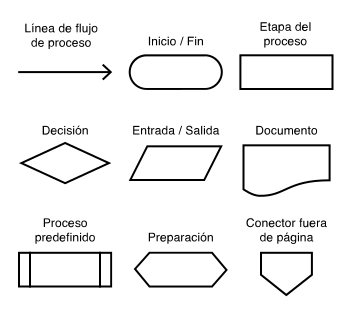

# Curso de pensamiento lógico

## Sistema binario

Sistema numérico representado por 0-1

- Para convertir de decimal a binario se divide por 2 y se toma el residuo.

$$
28 \to 11100 \left\{
\begin{array}{ll}
28 & |2 \\
0 & \overline{14} & |2 \\
\uparrow & 0 & \overline{7} & |2\\
& \uparrow & 1 & \overline{6} & |2\\
& & \uparrow & 1 & \overline{1} \\
& & & \uparrow & \uparrow
\end{array}
\right.
$$

- Para convertir de binario a decimal se multiplica en funcion de potencias de 2 y se suma el resultado de cada multiplicación.

$$
11100 \to 28 \left\{
\begin{array}{ll}
0 & * & 2^0 & = &0 & * & 1 & = & 0\\
0 & * & 2^1 & = &0 & * & 2 & = & 0\\
1 & * & 2^2 & = &1 & * & 4 & = & 4\\
1 & * & 2^3 & = &1 & * & 8 & = & 8\\
1 & * & 2^4 & = &1 & * & 16 & = & 16\\
\\
0 & + & 0 & + & 4 & + & 8 & + & 16 & = & 28
\end{array}
\right.
$$

## Operaciones de binarios

Las operaciones se realizan en base a las siguientes reglas:

- Suma:

$$
Suma \left\{
\begin{array}{ll}
0 & + & 0 & = & 1 \\
1 & + & 0 & = & 1 \\
0 & + & 1 & = & 1 \\
1 & + & 1 & = & 0 & \leftarrow acarrea+1\\
\end{array}
\right.
$$

- Resta

$$
Resta \left\{
\begin{array}{ll}
0 & - & 0 & = & 0 \\
1 & - & 0 & = & 1 \\
0 & - & 1 & = & 1 & \leftarrow acarrea+1\\
1 & - & 1 & = & 0 \\
\end{array}
\right.
$$

- Multiplicación

$$
Multiplicacion \left\{
\begin{array}{ll}
0 & * & 0 & = & 0 \\
1 & * & 0 & = & 0 \\
0 & * & 1 & = & 0 \\
1 & * & 1 & = & 1 \\
\end{array}
\right.
$$

Para la division no se basa en reglas, en cambio se realiza el siguiente procedimiento:

Dividendo = 10110
Divisor = 10

_Se debe cumplir la condición de que si divisor < dividendo entonces poner 1, de lo contrario poner 0 en resultado y bajar el siguiente número, a continuación restar por el divisor de nuevo_

$$
\begin{array}{ll}
&01011 \leftarrow resultado\\
10 & |\overline{10110}\\
 -&10\downarrow \downarrow \downarrow\\
&\overline{0011} \downarrow\\
-&10 \\
&\overline{010}\\
-&10 \\
&\overline{00}
\end{array}
$$

## Tablas de verdad

Sirven para determinar condiciones necesarias para que sea verdadero o falso un enunciado

- Negación

|A|¬A|
|-|--|
|V|F|
|F|V|

- Conjunción

|A|B|A ∧ B|
|-|-|----|
|V|V|V|
|V|F|F|
|F|V|F|
|F|F|F|

- Disyunción

|A|B|A ∨ B|
|-|-|----|
|V|V|V|
|V|F|V|
|F|V|V|
|F|F|F|

## ¿Qué es un algoritmo?

Serie de pasos secuenciales para lograr un objetivo de la mejor manera, para plantearlo se necesita

1. Analisis: Evaluar la situación y las variables implicadas
2. Definir el paso a paso de la solución
3. Dividir en partes pequeñas para entender el problema

## ¿Qué es un diagrama de flujo?

Forma de representar un algoritmo visualmente

## Tipos de datos

- Texto: Compuesto por letras, caracteres, simbolos especiales y espacios
- Numérico: Numeros, pueden dividirse en int-> entero o float -> decimales
- Booleano: Representa una cantidad lógica (true = 1, false = 0)
- Array: Estructura qeu permite almacenar un conjunto de datos del mismo tipo

## Estructuras de control

- Condicionales: Decision a partir de una comparación
  - if/else -> Basado en true/false
  - switch -> Evalua diferentes casos
  - try/catch -> Plan B en caso de fallo

- Ciclos:
  - for
  - while
  - do while

- Función: Bloque de instrucciones que hacen una actividad específica de forma independiente. Tiene 3 componentes:
  - Parametros: Valores que reciben la función
  - Instrucciones: Operaciones de la función
  - Resultado: Valor final que entrega la función
El alcance puede ser publico o privado

## Lenguajes de programación

### Javascript

- Basado en prototipos
- Equipo con HTML y CSS
- Es debilmente tipado
- Ofrece flexibilidad y versatilidad
- Base de herramientas web
- No necesita maquina virtual
- Interpretado por el navegador

### Python

- Desarrollo backend
- Procesamiento de grandes datos
- Videojuegos
- Facil interpretacion humana
- Curva de aprendizaje baja

### PHP

- Integración entre tecnologías
- Embebido dentro del HTML
- Permite comunicarse directamente con el servidor
- Permite conmunicarse con la base de datos
- Desarrollo backend

### Java

- Multiplataforma - aplicaciones de escritorio
- Gran numero de librerias y comunidad
- Creación de API's
- Desarrollo backend
- Uso y gestión de memoria